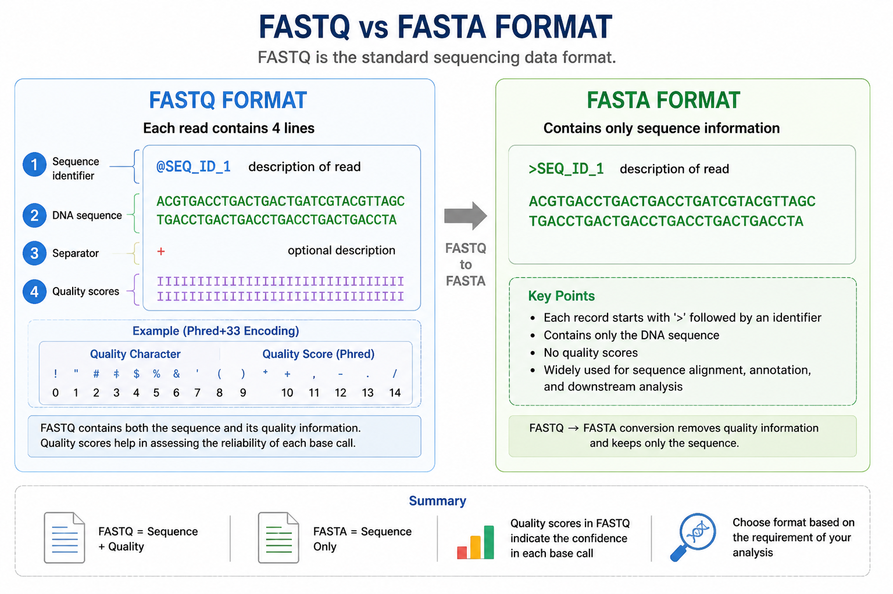
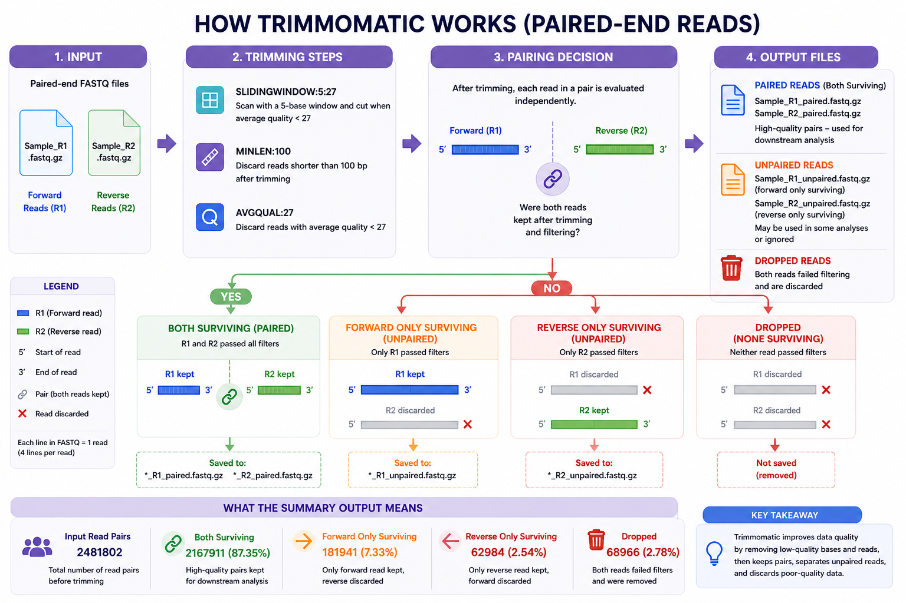
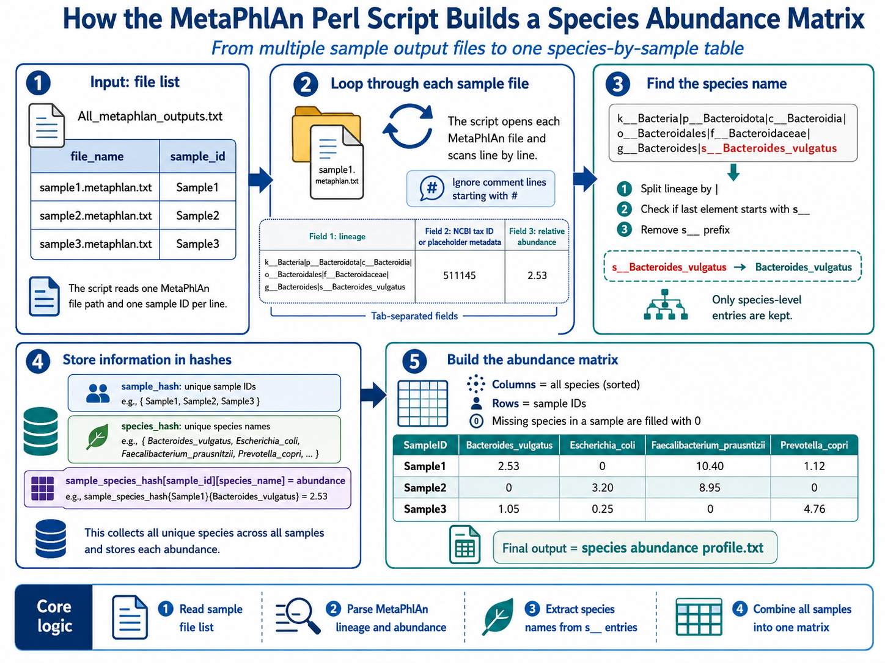

# Commands for Human Metagenomics Pre-processing

This hands-on session introduces the basic preprocessing steps in metagenomics analysis, including environment setup, quality control, trimming, taxonomic classification, and downstream data analysis in R.

For the practical session, we will directly use Trimmomatic, SPINGO, and MetaPhlAn 3. The required environments and databases have already been downloaded and configured on the workshop systems.

---

## Workflow Overview


**Raw FASTQ → Quality Check → Trimming → Clean Reads → Taxonomic Classification**

---

## 🔹 STEP 1: Install Miniconda

### Purpose

Miniconda is used to manage software and dependencies in isolated environments, preventing conflicts between different tools.

It can be considered a locker containing multiple separate compartments, where each compartment represents a different environment.


### Commands

```bash
wget https://repo.anaconda.com/miniconda/Miniconda3-latest-Linux-x86_64.sh

bash Miniconda3-latest-Linux-x86_64.sh

conda --version
```

### Notes

* Accept the licence agreement by typing `yes`.
* Use the default installation path.
* Initialize Conda when prompted.
* Restart the terminal or run `source ~/.bashrc` after installation.

---

## 🔹 STEP 2: Create Environments

### Purpose

Each tool is installed in a separate environment to avoid dependency conflicts.

### FastQC Environment

```bash
# Create the FastQC environment
conda create -n fastqc_env -y

# Activate the environment
conda activate fastqc_env

# Install FastQC
conda install -c bioconda fastqc -y

# Verify the installation
fastqc --version
```

### Trimmomatic Environment

```bash
# Create the Trimmomatic environment
conda create -n trim_env -y

# Activate the environment
conda activate trim_env

# Install Trimmomatic
conda install -c bioconda trimmomatic -y

# Verify the installation
trimmomatic -version
```

> **Workshop note:** For this hands-on session, a Conda environment named `microbiome` has already been created. It contains Trimmomatic and MetaPhlAn 3.

---

## 🔹 STEP 3: Understanding the FASTQ Format

### Purpose

FASTQ is the standard format used to store sequencing reads and their corresponding quality scores.

Each read contains four lines:

1. Sequence identifier
2. DNA sequence
3. Separator (`+`)
4. Quality scores



### View FASTQ Content

```bash
zcat sample_R1_paired.fastq.gz | head -n 8
```

### Convert Compressed FASTQ to FASTQ

```bash
zcat sample_R1_paired.fastq.gz > sample_R1_paired.fastq
```

### Convert FASTQ to FASTA

```bash
awk 'NR%4==1 {gsub("@",">",$0); print} NR%4==2 {print}' \
  sample_R1_paired.fastq \
  > sample_R1_paired.fasta
```

---

## 🔹 STEP 4: Quality Check with FastQC

### Purpose

FastQC is used to assess sequencing quality before further analysis.

```bash
conda activate fastqc_env

fastqc 01071_S110_R1.fastq.gz 01071_S110_R2.fastq.gz
```

### Output

FastQC produces the following files for each input FASTQ file:

* An HTML quality-control report
* A ZIP archive containing additional details

### View Reports Temporarily in a Browser

```bash
python3 -m http.server 8000
```

Stop the temporary server using:

```text
Ctrl + C
```

---

## 🔹 STEP 5: Trimming Reads with Trimmomatic

### Purpose

Trimmomatic removes low-quality bases and reads that do not meet the selected quality and length thresholds.

```bash
conda activate microbiome

trimmomatic PE \
  -threads 30 \
  -phred33 \
  -trimlog trimlog_sample_R1.log \
  01071_S110_R1.fastq.gz \
  01071_S110_R2.fastq.gz \
  01071_S110_R1_paired.fastq.gz \
  01071_S110_R1_unpaired.fastq.gz \
  01071_S110_R2_paired.fastq.gz \
  01071_S110_R2_unpaired.fastq.gz \
  SLIDINGWINDOW:5:27 \
  MINLEN:100 \
  AVGQUAL:27
```

### Output Files

Important paired-read outputs:

* `01071_S110_R1_paired.fastq.gz`
* `01071_S110_R2_paired.fastq.gz`

Optional unpaired-read outputs:

* `01071_S110_R1_unpaired.fastq.gz`
* `01071_S110_R2_unpaired.fastq.gz`



---

## 🔁 Batch Trimmomatic Processing

Create the output directory:

```bash
mkdir -p Trimmomatic_output
```

Run Trimmomatic for all paired-end samples:

```bash
for file in *_R1.fastq.gz; do

    base=$(basename "$file" _R1.fastq.gz)
    file_r2="${base}_R2.fastq.gz"

    if [[ ! -f "$file_r2" ]]; then
        echo "R2 file not found for ${base}. Skipping."
        continue
    fi

    echo "Processing ${base}..."

    trimmomatic PE \
      -threads 30 \
      -phred33 \
      -trimlog "Trimmomatic_output/trimlog_${base}.log" \
      "${base}_R1.fastq.gz" \
      "${base}_R2.fastq.gz" \
      "Trimmomatic_output/${base}_R1_paired.fastq.gz" \
      "Trimmomatic_output/${base}_R1_unpaired.fastq.gz" \
      "Trimmomatic_output/${base}_R2_paired.fastq.gz" \
      "Trimmomatic_output/${base}_R2_unpaired.fastq.gz" \
      SLIDINGWINDOW:5:27 \
      MINLEN:100 \
      AVGQUAL:27

    echo "Finished ${base}."

done
```

---

## 🔹 STEP 6: Taxonomic Classification with SPINGO

### Purpose

SPINGO assigns taxonomy to 16S rRNA sequencing reads using a reference database.

### Requirements

* Download SPINGO from its GitHub repository (https://github.com/GuyAllard/SPINGO)
* Extract the downloaded ZIP file.
* Download the RDP 16S reference database.
* Ensure that the SPINGO executable and database paths are correct.

### Merge Paired-End Reads

```bash
zcat \
  01071_S110_R1_paired.fastq.gz \
  01071_S110_R2_paired.fastq.gz \
  > 01071_S110_merged.fastq
```

### Convert FASTQ to FASTA

```bash
awk 'NR%4==1 {gsub("@",">",$0); print} NR%4==2 {print}' \
  01071_S110_merged.fastq \
  > 01071_S110_merged.fasta
```

### Run SPINGO

```bash
/ldaphome/tarini.ghosh/SPINGO-master/spingo \
  -d /ldaphome/tarini.ghosh/SPINGO-master/database/RDP_11.2.species.fa \
  -p 12 \
  -i 01071_S110_merged.fasta \
  > 01071_S110.spingo.out.txt
```

---

## 🔁 Batch SPINGO Processing

```bash
for f1 in *_R1_paired.fastq.gz; do

    sample=$(basename "$f1" _R1_paired.fastq.gz)
    f2="${sample}_R2_paired.fastq.gz"

    if [[ ! -f "$f2" ]]; then
        echo "R2 file not found for ${sample}. Skipping."
        continue
    fi

    echo "Processing ${sample}..."

    # Merge paired-end reads
    zcat "$f1" "$f2" > "${sample}_merged.fastq"

    # Convert FASTQ to FASTA
    awk 'NR%4==1 {gsub("@",">",$0); print} NR%4==2 {print}' \
      "${sample}_merged.fastq" \
      > "${sample}_merged.fasta"

    # Run SPINGO
    /ldaphome/tarini.ghosh/SPINGO-master/spingo \
      -d /ldaphome/tarini.ghosh/SPINGO-master/database/RDP_11.2.species.fa \
      -p 12 \
      -i "${sample}_merged.fasta" \
      > "${sample}.spingo.out.txt"

    # Remove temporary files
    rm -f "${sample}_merged.fastq" "${sample}_merged.fasta"

    echo "Done with ${sample}."

done
```

### Create an Abundance Matrix from SPINGO Outputs

Each sample produces one output file ending in `.spingo.out.txt`.

Create a list of all SPINGO output files:

```bash
ls *.spingo.out.txt > All_spingo_outputs.txt
```

Check the generated file list:

```bash
cat All_spingo_outputs.txt
```

### Species-level Abundance Matrix

```bash
perl create_species_matrix.pl \
  All_spingo_outputs.txt \
  > SpeciesAbundance_profile.txt
```

### Genus-level Abundance Matrix

```bash
perl create_genus_matrix.pl \
  All_spingo_outputs.txt \
  > GenusAbundance_profile.txt
```

---

## 🔹 STEP 7: Taxonomic Classification with MetaPhlAn 3

### Purpose

MetaPhlAn performs taxonomic profiling of whole-metagenome shotgun sequencing data using clade-specific marker genes.

MetaPhlAn uses its own marker-gene database derived from ChocoPhlAn.

### Requirements

* Install MetaPhlAn using Conda so that all dependencies are installed correctly (https://github.com/biobakery/biobakery/wiki/metaphlan3)
* Download and index the appropriate MetaPhlAn database.
* Alternatively, allow MetaPhlAn to download a compatible database automatically.

### Merge Paired-End Reads

```bash
zcat \
  ERR2764790_1.fastq.gz \
  ERR2764790_2.fastq.gz \
  > ERR2764790_merged.fastq
```

### Run MetaPhlAn

```bash
metaphlan ERR2764790_merged.fastq \
  --input_type fastq \
  --nproc 12 \
  --bowtie2db /ldaphome/tarini.ghosh/wgs_data/DB \
  --index mpa_v31_CHOCOPhlAn_201901 \
  -o ERR2764790.metaphlan.txt
```

---

## 🔁 Batch MetaPhlAn Processing

```bash
for f1 in *_R1_paired.fastq.gz; do

    sample=$(basename "$f1" _R1_paired.fastq.gz)
    f2="${sample}_R2_paired.fastq.gz"

    if [[ ! -f "$f2" ]]; then
        echo "R2 file not found for ${sample}. Skipping."
        continue
    fi

    echo "Processing ${sample}..."

    # Merge paired-end reads
    zcat "$f1" "$f2" > "${sample}_merged.fastq"

    # Run MetaPhlAn
    metaphlan "${sample}_merged.fastq" \
      --input_type fastq \
      --nproc 64 \
      --bowtie2db /ldaphome/tarini.ghosh/wgs_data/DB \
      --index mpa_v31_CHOCOPhlAn_201901 \
      -o "${sample}.metaphlan.txt"

    # Remove the temporary merged file
    rm -f "${sample}_merged.fastq"

    echo "Done with ${sample}."

done
```

### Create an Abundance Matrix from MetaPhlAn Outputs

Each sample produces one output file ending in `.metaphlan.txt`.

Create a two-column, tab-separated input file containing the MetaPhlAn output filename and corresponding sample ID:

```bash
ls *.metaphlan.txt > metaphlan_file_names.txt

ls *.metaphlan.txt |
  sed 's/\.metaphlan\.txt$//' \
  > metaphlan_sample_ids.txt

paste \
  metaphlan_file_names.txt \
  metaphlan_sample_ids.txt \
  > All_metaphlan_outputs.txt
```

Check the generated file:

```bash
column -t All_metaphlan_outputs.txt
```

### Species-level Abundance Matrix

```bash
perl create_metaphlan_species_matrix.pl \
  All_metaphlan_outputs.txt \
  SpeciesAbundance_profile.txt
```

### Genus-level Abundance Matrix

```bash
perl create_metaphlan_genus_matrix.pl \
  All_metaphlan_outputs.txt \
  GenusAbundance_profile.txt
```

---

## MetaPhlAn Matrix-generation Workflow



Note: All Images used are generated by GPT AI
