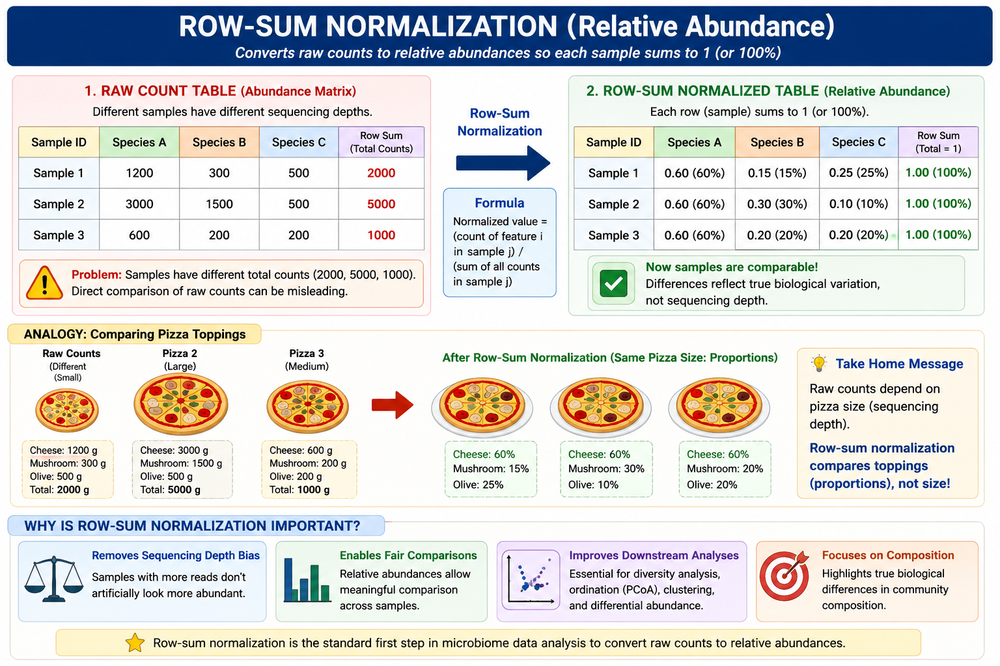
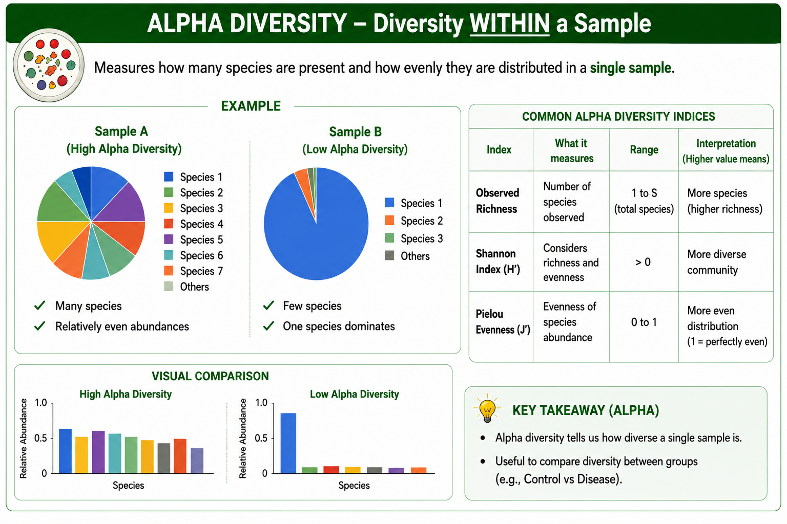
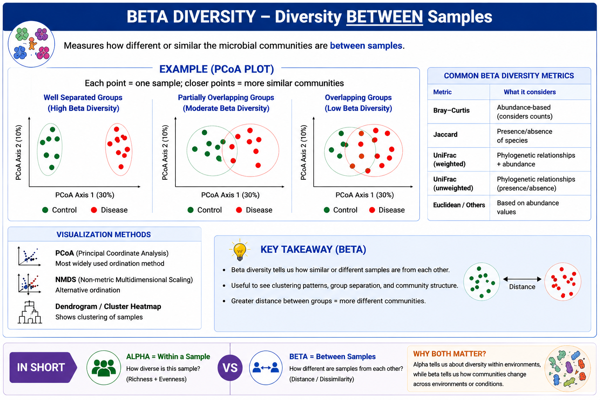

# Human Metagenomics Data Analysis in R

This practical covers downstream microbiome analysis using processed taxonomic abundance profiles, including data import, abundance normalization, alpha diversity, and beta diversity.

---

## Workflow Overview

**Taxonomic Abundance Matrix → Normalization → Alpha Diversity → Beta Diversity**

---

## 🔹 STEP 1: Load Data into RStudio

### Set the Working Directory

Set the working directory to the folder containing the abundance matrices and metadata.

```r
setwd("/ldaphome/tarini.ghosh/Downloads/")
```

Check the current working directory:

```r
getwd()
```

### Import the Species-level Abundance Matrix

```r
species_matrix <- read.delim("SpeciesAbundance_profile.txt", row.names = 1)
```

For the following analysis, the species-level abundance matrix will be used.

### Import the Metadata

```r
library(readxl)
metadata_df <- read.delim("metadata_df.txt", row.names = 1)
```

Assign the sample IDs as row names:

```r
rownames(metadata_df) <- metadata_df$sample_id
```

### Check the Imported Data

```r
dim(species_matrix)
dim(metadata_df)
```

```r
head(species_matrix)
head(metadata_df)
```

### Check the rownames are ordered in species df and metadata df

```r
all(rownames(species_matrix) == rownames(metadata_df))
```

---

## 🔹 STEP 2: Normalize the Abundance Matrix

### Purpose

In your abundance matrix, different samples may have different total counts or total relative abundance. Without normalization, a sample with more sequencing reads could appear to have higher microbial abundance simply because it was sequenced more deeply.



### Check Row Sums

```r
rowSums(species_matrix)
```

### Remove Samples with a Total Abundance of Zero

```r
species_matrix <- species_matrix[rowSums(species_matrix, na.rm = TRUE) > 0, ,drop = FALSE]
```

Update the metadata after removing zero-sum samples:

```r
metadata_df <- metadata_df[rownames(species_matrix), ,drop = FALSE]
```

### Perform Row-sum Normalization

```r
species_matrix_norm <- species_matrix/rowSums(species_matrix)
```

### Confirm the Normalization

```r
rowSums(species_matrix_norm)
```

---

## 🔹 STEP 3: Alpha Diversity

### Purpose

Calculate microbial diversity and evenness for each sample.



### Install the Required Packages

```r
install.packages("vegan")
install.packages("vioplot")
```

### Load the Required Packages

```r
library(vegan)
library(vioplot)
```

### Calculate Shannon Diversity

```r
shannon_index <- diversity(species_matrix_norm,index = "shannon")
```

### Calculate Pielou Evenness

```r
calculate_pielou <- function(mat) {

  shannon <- diversity(
    mat,
    index = "shannon"
  )

  richness <- rowSums(mat > 0)

  pielou <- ifelse(
    richness > 1,
    shannon / log(richness),
    NA
  )

  return(pielou)
}
```

```r
pielou_index <- calculate_pielou(species_matrix_norm)
```

### Create the Alpha-diversity Data Frame

```r
alpha_diversity_df <- data.frame(
  sample_id = rownames(metadata_df),
  study_condition = metadata_df$study_condition,
  shannon = shannon_index,
  pielou = pielou_index
)
```

### View the Results

```r
head(alpha_diversity_df)
```

---

## 🔹 STEP 5: Visualize Alpha Diversity

### Shannon Diversity Boxplot

```r
boxplot(
  shannon ~ study_condition,
  data = alpha_diversity_df,
  col = c("turquoise3", "pink2"),
  xlab = "Study condition",
  ylab = "Shannon diversity"
)
```

### Shannon Diversity Violin Plot

```r
vioplot(
  shannon ~ study_condition,
  data = alpha_diversity_df,
  col = c("turquoise3", "pink2"),
  xlab = "Study condition",
  ylab = "Shannon diversity"
)
```

### Shannon Diversity Wilcoxon Test

```r
wilcox.test(
  alpha_diversity_df$shannon[
    alpha_diversity_df$study_condition == "Control"
  ],
  alpha_diversity_df$shannon[
    alpha_diversity_df$study_condition == "UC"
  ]
)
```

### Pielou Evenness Boxplot

```r
boxplot(
  pielou ~ study_condition,
  data = alpha_diversity_df,
  col = c("turquoise3", "pink2"),
  xlab = "Study condition",
  ylab = "Pielou evenness"
)
```

### Pielou Evenness Violin Plot

```r
vioplot(
  pielou ~ study_condition,
  data = alpha_diversity_df,
  col = c("turquoise3", "pink2"),
  xlab = "Study condition",
  ylab = "Pielou evenness"
)
```

### Pielou Evenness Wilcoxon Test

```r
wilcox.test(
  alpha_diversity_df$pielou[
    alpha_diversity_df$study_condition == "Control"
  ],
  alpha_diversity_df$pielou[
    alpha_diversity_df$study_condition == "UC"
  ]
)
```

---

## 🔹 STEP 6: Beta Diversity

### Purpose

Evaluate differences in microbial community composition between the study groups using Bray–Curtis distance and Principal Coordinates Analysis.



### Install the Required Packages

```r
install.packages("vegan")
install.packages("ggplot2")
```

### Load the Required Packages

```r
library(vegan)
library(ggplot2)
```

---

### Calculate Bray–Curtis Distance

```r
dist_bray <- vegdist(species_matrix_norm,method = "bray")
```

---

### Perform Principal Coordinates Analysis

```r
pcoa_bray <- cmdscale(dist_bray,k = 2,eig = TRUE)
```

---

### Create the Plotting Data Frame

```r
pcoa_bray_df <- data.frame(
  sample_id = rownames(pcoa_bray$points),
  PCoA1 = pcoa_bray$points[, 1],
  PCoA2 = pcoa_bray$points[, 2],
  study_condition = metadata_df$study_condition
)
```

---

### Plot Bray–Curtis PCoA

```r
ggplot(
  pcoa_bray_df,
  aes(
    x = PCoA1,
    y = PCoA2,
    color = study_condition
  )
) +
  geom_point(size = 3) +
  stat_ellipse(level = 0.95) +
  theme_minimal() +
  labs(
    title = "PCoA – Bray–Curtis Distance",
    x = "PCoA1",
    y = "PCoA2",
    color = "Study condition"
  )
```

---

### Test Group Differences Using PERMANOVA

```r
adonis_bray <- adonis2(
  dist_bray ~ study_condition,
  data = metadata_df,
  permutations = 999
)
```

```r
adonis_bray
```

The PERMANOVA result indicates whether the overall microbial community composition differs significantly between the study groups.


---

## How do we use the publicly Available data for Analysis in our lab - Microbiome Informatics Lab, IIIT-Delhi?


---


Note: All Images used are generated using GPT AI
---
